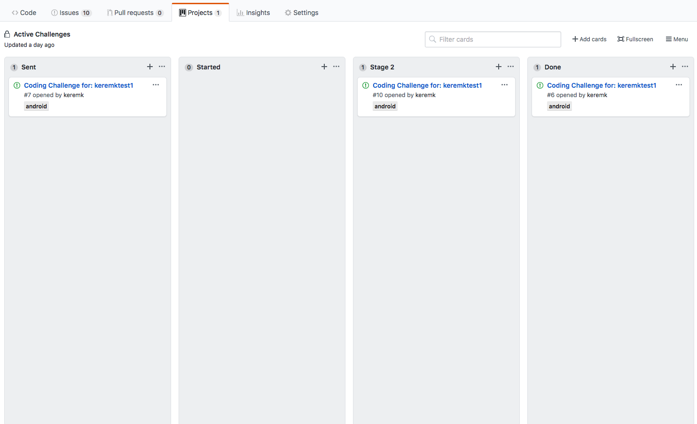

# Code Challenges Using Github

This tool allows you to create a coding challenge based on a template repository. When it creates the coding challenge it also invites a candidate (with their Github name) to the repository and also adds this to a tracking repository as issues. The tracking repository can be configured with a project (using the regular Github UX) to track the status of coding challenge.

## Introduction

In order to use the tool, first you need to configure it. Once the configuration is done the usage is as easy as follows:

```
challenge create -u CANDIDATEGITHUBUSERNAME -d DISCIPLINEASCONFIGURED

```

The above command will in turn:

* Read the configuration file in the below folder (convention):

  `~/.coding-challenges/.challenge.yaml`

* Create a new private repository under the Github owner or organization as specified in the configuration file. The naming convention for the repo is 

  `test_DISCIPLINEASCONFIGURED_CANDIDATEGITHUBUSERNAME`

* Clone a starter project for the DISCIPLINEASCONFIGURED (also specified in the configuration file) to this newly created private repository (using the templateRepoName information provided)
* Create an issue (first coding challenge task) in the new private repository. This uses the issue template provided in the specified folder structure. Example: 

  `~/.coding-challenges/issue-templates/DISCIPLINEASCONFIGURED/task-1.md`

* Create an issue in the tracking project as specified in the `trackingRepoName` in the configuration file. See section on Challenge Tracking to see how you can keep track of the candidates using Github's built-in project management features.
* Add the CANDIDATEGITHUBUSERNAME to the project as a collaborator with PUSH rights. This will in turn send a standart Github Invite Collaborator email to the candidate.

## Configuration

### Challenge Configuration File
In order to configure, you need to create a `.challenge.yaml` file:

| Attribute | Description | 
| --------- | ------------| 
| organization | This is the Github organization name where the coding challenges are located. If you are doing this from non-organization account, leave it as an empty string |
| owner | Github alias of who has access to the this repo - can create repos, has admin access. See the section on "Creatings Tokens". |
| trackingRepoName | Name of the special repository to be able to track the candidates. Each code challenge sent to a candidate is going to be created as an issue in this repository to do tracking. |
| githubToken | Your github token to be able to create and push to repositories. See the section on "Creatings Tokens". |
| challenges | The list of coding challenge templates. |
| discipline | The name of the discipline for coding challenge. E.g. android, ios ... |
| templateRepoName | The name of the repository for the template project for a given discipline. The full URL will be generated from owner and organization information. |
| reviewers | List of github names of reviewers. |
| tasks | List of tasks for the coding challenge. These will be generated as github issues as the coding challenge progresses |
| level | The ordinal for the task. E.g. 1 means the first task to be created. | 
| title | The task title - this corresponds to a Github issue title. |
| descriptionFile | The relative path (see the folder structure - under issue-templates) to the file that describes the task in detail. You can used markdown files to describe the task. |


**Example configuration:**

``` yaml
config:
  organization: myorg
  owner: mygithubname 
  trackingRepoName: coding-challenges
  creator:
    githubToken: Copy and paste the token you generate from Github
  challenges:
    - 
      discipline: android
      templateRepoName: android_cc_template
      reviewers:
        - Reviewer1GithubName
        - Reviewer2GithubName
      tasks:
        - 
          level: 1
          title: "Task 1 title"
          descriptionFile: "android/task-1.md"
        - 
          level: 2
          title: "Task 2 title"
          descriptionFile: "android/task-2.md"
```

### Folder Structure

The default configuration folder structure is:

```
~/.coding-challenges
  /.challenge.yaml
  /issue-templates
    /discipline1
      task-1.md
      task-2.md
    /discipline2
      task-1.md
      task-2.md
```

## Challenge Tracking And Management Repo

If you configure another repo (e.g. `coding-challenges`), then the tool will create issues in this repository as well. You need to configure this in the configuration file under `trackingRepoName`.

Below is a screen shot, which shows 3 coding challenges in progress. The project is a standard Github project and you can configure it any way you want. Then because the issues are created here you will be able see them and create cards in the project as shown:



It is at the moment up to you to move the cards manually in the project, the tool does not manage that.

## Creating a Github Token

In order for the tool to work you need to create a [personal access token in Github](https://github.com/settings/tokens) with the `repo` permissions.  